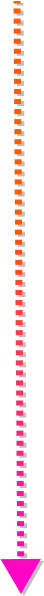

<!DOCTYPE html>
<html lang="en">
<head>
  <meta charset="UTF-8">
  <meta name="viewport" content="width=device-width, initial-scale=1.0">
  <meta http-equiv="X-UA-Compatible" content="ie=edge">
  <link rel="stylesheet" href="css/main.css">
  <link rel="stylesheet" href="https://cdnjs.cloudflare.com/ajax/libs/animate.css/4.0.0/animate.min.css"/>
  <link rel="shortcut icon" href="" type="image/x-icon">
  
  <title>Falcon Project</title>
</head>
<body>
  

    

      

      

      

      

    

    <header class="header">
      

        <nav class="nav__menu">
          

            <ul class="nav__menu__list-item">
              <li>
                <a href="#article" class="item__link">about</a>
                <a href="#roadmap" class="item__link">roadmap</a>
                <a href="#comminity" class="item__link">comminity</a>
                <a href="#team" class="item__link">team</a>
                <a href="" class="item__link">events</a>
                <a href="" class="item__link">swap</a>
              </li>
            </ul>
          

          

            
            
            
          

        </nav>
      

      

        
        
        
      

      

        
        
        
      

      

    </header>
    

      <section class="section">
        

          

            

              

                <h1>falcon project</h1>
              

              

                
This is an ecosystem that includes two completely interchangeable   blockchains.

              

            

            

              
            

          

        

      </section>
      <article class="article">
        
        

          

            

              <h3>about</h3>
            

            

              

                
The
                   first chain is an erc-20 token located on the Ethereum blockchain, convenient and familiar to use by all of us, whether you are a user or a developer.

              

              

                
The
                  second chain is the Falcon blockchain, which allows optional anonymous transactions.

              

            

            

                
            

            

              

                  By linking the two together, Falcon Project offers its users the right to choose what suits them best at the moment: speed and convenience or anonymity and privacy. This approach works on the principle of free exchange of a token for a coin in a 1: 1 ratio through a constantly available swap form on our official website. In this way you will always be able to exercise your right to completely confidential transactions using the Falcon coin when you need it. And in all other cases, just use the convenient Falcon token, which will be traded on all available exchanges. Simple, easy and convenient!
                  Falcon Project is a complete ecosystem, not just a token, coin, or DEX.
              

            

            

              

                

                  <h4>Unique reward system.</h4>
                

                

                  The reward system for Falcon token holders is very interesting and unique. Anyone who has a deposit of at least 1,000,000 Falcon tokens or a multiple of them can exchange their tokens for an ERC-1155 voucher, equivalent to the amount he wants to freeze to receive HOLD awards in the amount of 10% once a quarter (3 months), which together makes up a return of 40% per annum.
                

              

              

                
              

              

                
Important!  The number of vouchers will be limited to the issue of 5,000,000,000 (five billion) tokens, which is 14% of the total starting issue of the Falcon token. Given the wide demand for this reward system, the number of tokens frozen in vouchers will be increased using tokens in the freeze fund. In this case, the percentage of remuneration will decrease over time.

              

            

          

        

        
        

          

            

              <h3>roadmap</h3>
            

            
2020

            

              
            

            

              

                

                  Website development and design
                  Creating an ERC-20 Token
                  
                      Creation STAGE collection cards and vouchers ERC-1155
                  
                  Airdrop stage 1
                  Airdrop stage 2
                  Airdrop FNT token to STAGE holders.
                

                

                  Testing existing Anonymous Blockchains
                  Creating and launching FNC, Falcon anonymous blockchain
                  Launching the FNT to FNC swap system
                

                

                  Falcon Project Ecosystem Expansion
                

              

              

                
              

              

                

                  Exchange listings
                  Launching a token swap system for a voucher
                  Launching the Proof of Hold Reward System
                

                

                  Expanding the impact of the project through integrations and establishing friendly communications with leading industry projects and gaming platforms
                  
                

              

            

          

        

      </article>
    

    

      
      

        <h2>comminity</h2>
      

      

        

          
        

        

          
        

        

          
        

        

          
        

        

          
        

      

    

    

      
      

        <h2>team members</h2>
      

      

        

          

            <h6>Co-founders:</h6>
          

          

            <a href="https://twitter.com/lavrus_crypto">Dmitriy aka Lavrus</a>
            <a href="https://twitter.com/Falcon_Pr0ject">Ivan</a>
            <a href="https://twitter.com/deadlinelogo">Deadlinelogo</a>
            <a href="https://twitter.com/agud_falcon">Alex Good</a>
          

        

        

          

            <h6>Team:</h6>
          

          

            <a href="https://twitter.com/vi_taly">Vitaly</a>
            <a href="https://twitter.com/shinobi_win">Shinobi</a>
            <a href="https://twitter.com/1mkoma">M K</a>
            <a href="https://twitter.com/Falcon_SBS">Burton</a>
            <a href="https://twitter.com/vi_taly">Abu-Bakr</a>
          

        

      

    

    <footer class="footer">
      

        

          

            
          

          

            <h5>© Falcon Project, 2020</h5>
          

        

      

    </footer>
  

</body>
</html>
